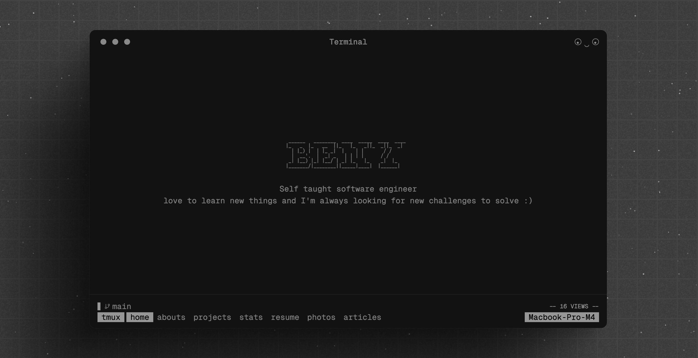
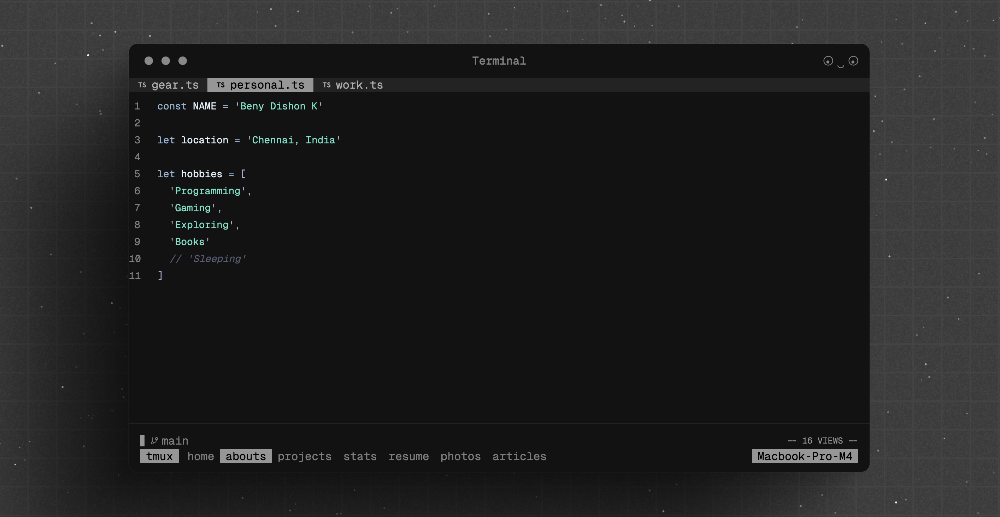
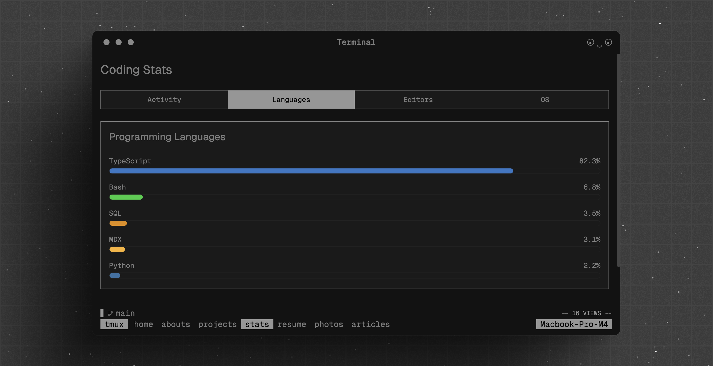
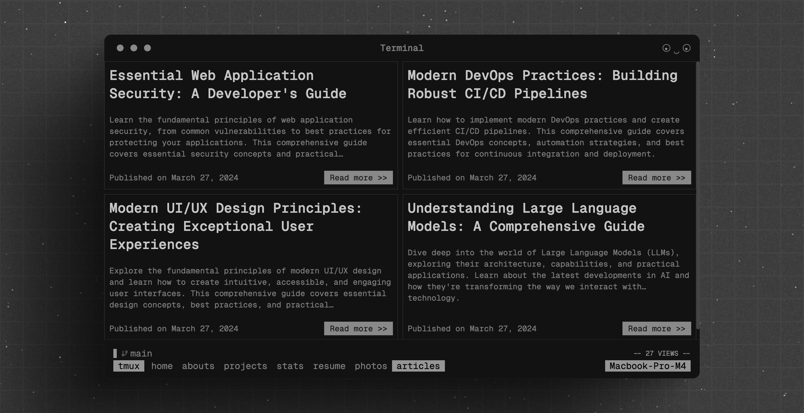
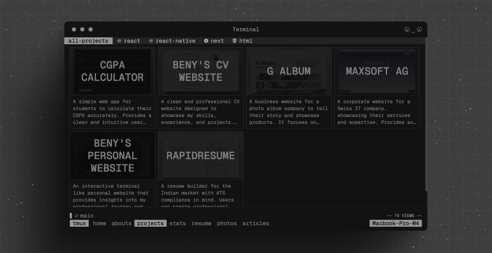

# Beny.one - Personal Terminal Website

A modern terminal-inspired personal website built with Next.js 15 and TailwindCSS.

## 📸 Preview







## ✨ Features

- Modern, clean design with light/dark mode support
- Interactive terminal interface with multiple commands
- Portfolio showcase with project details and skills
- Blog/Articles section with MDX support
- Responsive layout for all devices
- Fast page loads with Next.js App Router
- SEO optimized with metadata

## 🌦️ Weather API Integration

The terminal now supports a `weather` command that shows current weather information for any location. To enable this feature:

1. Sign up for a free API key at [OpenWeather](https://openweathermap.org/api)
2. Add your API key to the `.env.local` file:
   ```
   OPENWEATHER_API_KEY=your_api_key_here
   ```
3. Restart the development server

Without an API key, the weather command will still work but will display sample data.

## 🛠️ Tech Stack

- [Next.js 15](https://nextjs.org) - React framework for building full-stack web applications
- [TailwindCSS](https://tailwindcss.com) - Utility-first CSS framework
- [Umami Analytics](https://umami.is) - Privacy-focused analytics
- [TypeScript](https://typescriptlang.org) - Type-safe JavaScript
- [MDX](https://mdxjs.com) - Markdown for the component era

## 🚀 Getting Started

### Prerequisites

- Node.js 18+
- npm or yarn

### Installation

1. Clone the repository:

   ```bash
   git clone https://github.com/BenyD/beny.one.git
   cd beny.one
   ```

2. Install dependencies:

   ```bash
   npm install --legacy-peer-deps
   # or
   yarn install --ignore-peer-deps
   ```

3. Set up environment variables:
   Create a `.env.local` file with:

   ```
   UMAMI_API_KEY=your_api_key
   UMAMI_WEBSITE_ID=your_website_id
   UMAMI_SHARE_TOKEN=your_share_token
   UMAMI_URL=https://cloud.umami.is
   ```

4. Run the development server:

   ```bash
   npm run dev
   # or
   yarn dev
   ```

5. Open [http://localhost:3000](http://localhost:3000) in your browser.

## 🚢 Deployment on Vercel

This project uses React 19 and modern dependencies that may have peer dependency conflicts. To deploy successfully on Vercel:

1. **Use the included vercel.json configuration**:
   The project includes a `vercel.json` file that tells Vercel to use the `--legacy-peer-deps` flag during installation.

2. **Enable legacy peer deps in Vercel dashboard**:
   If you're still encountering issues, go to your project settings in the Vercel dashboard:

   - Navigate to Settings > General
   - Under Build & Development Settings, add an environment variable:
     - Key: `NPM_FLAGS`
     - Value: `--legacy-peer-deps`

3. **Note about TypeScript definitions**:
   This project uses exact versions (without ^) for React TypeScript definitions to avoid dependency conflicts:

   - `@types/react`: 19.0.12
   - `@types/react-dom`: 19.0.4

   If you encounter version not found errors, check npm registry for the latest available versions.

4. **Check the build logs**:
   If the build fails, review the logs for specific dependency conflicts. The project includes:
   - An `.npmrc` file with `legacy-peer-deps=true`
   - Package overrides in `package.json` to manage React type conflicts

## 📝 Project Structure

- `src/components` - Reusable UI components
- `src/app` - Next.js 15 app router pages and layout
- `src/lib` - Utility functions and constants
- `public` - Static assets

## 📊 Analytics Setup

This project uses Umami for privacy-focused analytics. To set up:

1. Create an account on [Umami](https://umami.is/)
2. Add your website to Umami dashboard
3. Copy your Website ID and Share Token to your environment variables

## 📄 License

MIT

## 🙏 Credits

Built by [Beny Dishon](https://github.com/BenyD)
